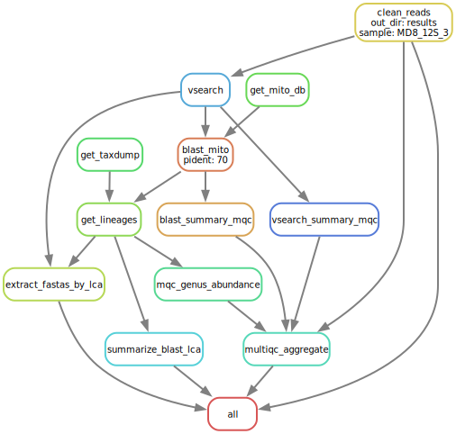

```
    ______     ___   ____    ____  __    ______   ______   .______        
   /      |   /   \  \   \  /   / |  |  /      | /  __  \  |   _  \       
  |  ,----'  /  ^  \  \   \/   /  |  | |  ,----'|  |  |  | |  |_)  |      
  |  |      /  /_\  \  \      /   |  | |  |     |  |  |  | |      /       
  |  `----./  _____  \  \    /    |  | |  `----.|  `--'  | |  |\  \----.  
   \______/__/     \__\  \__/     |__|  \______| \______/  | _| `._____|  
                                                                         
```

# CaviCor12s - 12S Amplicon Nanopore Pipeline

[](https://www.python.org/)
[](https://snakemake.readthedocs.io/)
[](./LICENSE)

This repository contains an in-development bioinformatics pipeline for the analysis of 12S Amplicon Nanopore sequencing data, created for the CaviCor project. It uses the [Snakemake](https://snakemake.readthedocs.io/) workflow management system to ensure reproducibility and scalability.

## Table of Contents
- [Features](#features)
- [Installation](#installation)
- [Configuration](#configuration)
- [Usage](#usage)
- [Output Structure](#output-structure)
- [Contributing](#contributing)

## Features
The pipeline automates the following analysis steps:
*   **Quality Control**: Filtering and trimming of raw Nanopore reads using `fastp`.
*   **Diversity Analysis**: Taxonomic classification using `blast` and `vsearch`.
*   **Taxonomy Assignment**: Lowest Common Ancestor (LCA) analysis.
*   **Rarefaction Analysis**: Generation of rarefaction curves to assess sampling depth.

## Installation

Follow these steps to set up the pipeline.

### 1. Prerequisites
Ensure you have Conda (Miniconda or Anaconda) installed on your system.

### 2. Clone the Repository
```bash
git clone https://github.com/matheus-cosentino/CaviCor12s.git # Replace with the actual repository URL
cd CaviCor12s
```

### 3. Setup Environment
This pipeline uses Conda to manage all software dependencies. Create and activate the main environment which includes Snakemake:
```bash
conda env create -f envs/cavicor.yaml
conda activate cavicor
```
Snakemake will automatically create the other required environments during the first run.

### 4. Download Dependencies
**NCBI Taxonomy Database**
The pipeline requires the NCBI taxonomy dump files for taxonomic classification.
```bash
# Navigate to the resources directory
cd resources/taxonomy/taxdump/

# Download the taxonomy dump files
wget ftp://ftp.ncbi.nih.gov/pub/taxonomy/taxdump.tar.gz

---use-conda: This flag tells Snakemake to automatically activate and manage the Conda environments defined in the workflow rules.
---cores all: This allocates all available CPU cores to the pipeline. You can specify a number (e.g., --cores 8) if you want to limit resource usage.
# Extract the files
tar -zxvf taxdump.tar.gz

cd ../../../ # Return to the project root
```
This will place files like `nodes.dmp` and `names.dmp` in the correct directory.

**BLAST Database**
You must provide a pre-formatted BLAST database (e.g., from NCBI or a custom one). Place the database files inside the `resources/blast/` directory.

## Configuration
All pipeline settings are controlled via the `config/config.yaml` file.

| Parameter | Description |
|---|---|
| `output_dir` | The main directory where all results will be saved. Default: `"results"`. |
| `data_dir` | The directory containing your raw input FASTQ files. Default: `"data"`. |

### Modules
Enable or disable specific parts of the analysis.

| Module | Description |
|---|---|
| `12s_diversity` | Set to `true` to perform BLAST and VSEARCH-based diversity analysis. |
| `quality_control` | Set to `true` to enable read quality control with `fastp`. |

### Tool Parameters
Adjust the parameters for the bioinformatics tools used in the pipeline. The commented-out values in the `config.yaml` serve as examples of alternative settings.

*   **`blast`**: `perc_identity`, `evalue`, `max_target_seqs`.
*   **`vsearch`**: `identity` threshold for clustering/alignment.
*   **`fastp`**: `min_quality`, `min_length`, `max_length` for read filtering.

## Usage

### 1. Prepare Input Data
Place your raw Nanopore FASTQ files (e.g., `sample1.fastq.gz`, `sample2.fastq.gz`) into the directory specified by `data_dir` in your `config.yaml` (default is `data/`).

### 2. Activate Environment
Make sure you are in the project's root directory and the `cavicor` conda environment is active:
```bash
conda activate cavicor
```

### 3. Execute Pipeline
Before running, it is highly recommended to perform a dry run to see the jobs that will be executed:
```bash
snakemake -n --use-conda
```

To execute the full pipeline, run:
```bash
snakemake --use-conda --cores <N>
```
*   `--use-conda`: Instructs Snakemake to use the conda environments specified in the workflow.
*   `--cores <N>`: Specifies the number of CPU cores to use (e.g., `--cores 8`).

### Advanced Usage
To visualize the workflow's Directed Acyclic Graph (DAG), you can run:

```bash
snakemake --dag | dot -Tsvg > resources/logo/dag.svg
```

This will generate an SVG file of the workflow graph.


## Output Structure
All results will be located in the directory specified by `output_dir` (default: `results/`). The structure will be as follows:

```
results/
└── [sample_name]/
    ├── Abundance/
    │   └── {sample}_{pident}_Abundance_table.tsv
    ├── Basta/
    │   └── {sample}_{pident}_LCA_Taxonomy.txt
    ├── Blast/
    │   └── {sample}_{pident}_Blastn_12s.txt
    └── Fasta_by_Genus_{pident}/
        └── {genus_name}.fasta
```

**Key Output Files:**
*   `Abundance/{sample}_{pident}_Abundance_table.tsv`: A table of taxonomic abundances for each sample at a given percent identity.
*   `Basta/{sample}_{pident}_LCA_Taxonomy.txt`: The Lowest Common Ancestor (LCA) taxonomic assignment for reads.
*   `Fasta_by_Genus_{pident}/`: A directory containing FASTA files where reads are separated by their assigned genus.

## Contributing
This project is in active development. Pull requests are welcome. For major changes, please open an issue first to discuss what you would like to change.
